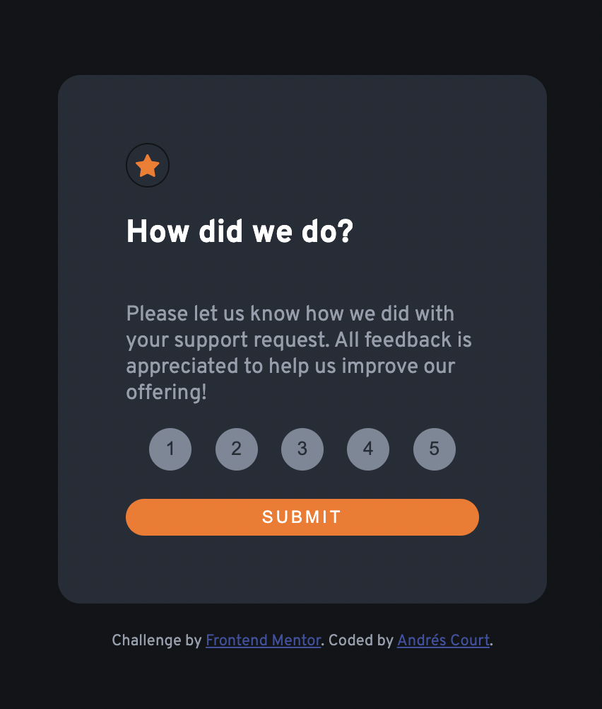

# Frontend Mentor - Interactive rating component solution

This is a solution to the [Interactive rating component challenge on Frontend Mentor](https://www.frontendmentor.io/challenges/interactive-rating-component-koxpeBUmI). Frontend Mentor challenges help you improve your coding skills by building realistic projects.

## Table of contents

- [Overview](#overview)
  - [The challenge](#the-challenge)
  - [Screenshot](#screenshot)
  - [Links](#links)
- [My process](#my-process)
  - [Built with](#built-with)
- [Author](#author)
  **Note: Delete this note and update the table of contents based on what sections you keep.**

## Overview

### The challenge

Users should be able to:

- View the optimal layout for the app depending on their device's screen size
- See hover states for all interactive elements on the page
- Select and submit a number rating
- See the "Thank you" card state after submitting a rating

### Screenshot

hh

### Links

- Solution URL: [Add solution URL here](http://interactive-rating.alcb1310.vercel.app/)

## My process

### Built with

- Semantic HTML5 markup
- CSS custom properties
- JavaScript

## Author

- Website - [Andres Court](https://www.your-site.com)
- Frontend Mentor - [@alcb1310](https://www.frontendmentor.io/profile/alcb1310)
- Twitter - [@alcb1310](https://www.twitter.com/alcb1310)
- GitHub - [@alcb1310](https://www.github.com/alcb1310)
